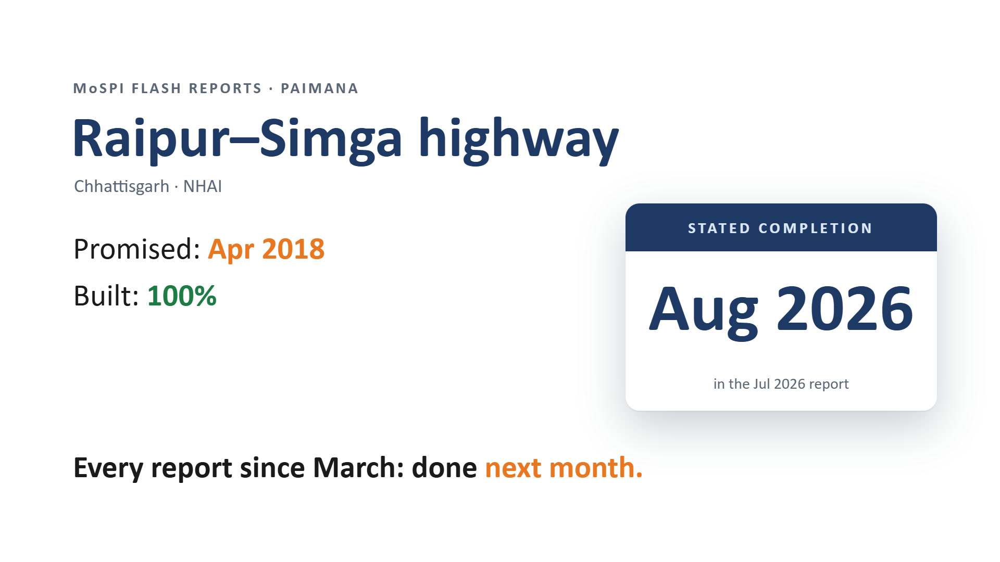

# ANUMAAN (अनुमान) — auditing the stated completion date

**Smart India Hackathon 2026 · Problem Statement SIH26103 (MoSPI / PAIMANA) · Team The Raftaar Titans**

Every month MoSPI publishes a Flash Report on each central-sector infrastructure
project costing ₹150 crore or more. Each report states the project's original
completion date and the agency's *current* estimate. Those estimates drift,
month after month, and nobody audits them.

ANUMAAN reads the real Flash Reports, builds a project × month panel, and
predicts **which projects will push their stated completion date out in the
next monthly report**. For each forecast it gives the reasons (SHAP), how the
project compares with its sector, and the evidence from the reports. It is
built for government use: ministry-scoped logins, an audit log, tamper-evident
code, offline use in low-connectivity areas, and hosting on Indian government
cloud with no foreign AI APIs.

[](anumaan/brag-output/brag.mp4)

▶ **[Watch the 23-second demo](anumaan/brag-output/brag.mp4)**. Every number in it comes from the running app ([how it was made](anumaan/brag-output/brag-plan.md)).

---

## Results on real data

| | |
|---|---|
| Source | 32 MoSPI Flash Report PDFs, each pinned by SHA-256 ([`data/raw/manifest.csv`](anumaan/data/raw/manifest.csv)) |
| Parsed | All 11 PAIMANA-era reports (Sep 2025 – Jul 2026) reconcile against their own printed totals |
| Panel | 17,010 project-months across 2,195 projects |
| Target | `slip_next`: will the stated completion date be later in the next monthly report? |
| Validation | Walk-forward only (train on months before June 2026, test on June 2026). No random split anywhere, and a leakage check runs on every training. |
| Model | LightGBM, PR-AUC **0.68** on the held-out month, against **0.28** for the best simple baseline and an 18.3% base rate |
| Top flags | Of the 141 highest-risk projects in June 2026, **125 moved their date in the July report** |
| Live forecast | All 1,775 projects in the July 2026 report, scored in one pass at startup (training takes 0.4–0.7 s on a CPU) |

The 21 older OCMS-era reports are not parsed yet. The reports publish no delay
cause, so cause routing works only on field remarks (see Laya below).

---

## What is new in this release

### Security for government data — [SECURITY.md](anumaan/SECURITY.md)

- **Ministry-scoped logins** (`mospi` / `ministry` roles, scrypt-hashed). A ministry sees only its own projects in every list, page, export and offline file; any other project returns 404.
- **Hash-chained audit log** of every view, export, remark and retrain. An edited, deleted or reordered line is detected (`scripts/verify_audit_log.py`).
- **Tamper-evident code.** `integrity/MANIFEST.json` records the SHA-256 of every sealed file and is signed with an HMAC key. The container refuses to start if any file changed, so an AI coding agent or anyone else cannot quietly change the backend. Rules for agents: [AGENTS.md](anumaan/AGENTS.md).
- **Fail-closed production.** The service will not start without logins, an admin token, the integrity key and an allowed-host list.
- **Web hardening.** Strict Content-Security-Policy, escaped rendering, host allow-list, request-size cap, per-user rate limits.
- **Container hardening.** Read-only, non-root, all capabilities dropped.
- **DPDP-safe redaction** of phone, e-mail, Aadhaar, PAN, IFSC and account numbers from free-text remarks.
- **Supply chain.** CODEOWNERS, pinned GitHub Actions, Dependabot, `pip-audit` / `npm audit` in CI, and an SBOM plus AI-BOM (CycloneDX 1.6).
- **Threat model:** [docs/SECURITY-THREAT-MODEL.md](anumaan/docs/SECURITY-THREAT-MODEL.md).

### Speed (measured, median of 40 requests)

| Request | Before | After | On the wire |
|---|---|---|---|
| Watchlist, 60 projects | 30.2 ms | 4.0 ms | 5.1 KB |
| Watchlist, 500 projects | 113.8 ms | 8.8 ms | 36.2 KB |
| One project with SHAP | 56.3 ms | 8.8 ms | 1.7 KB |
| Full snapshot, 1,775 projects | — | 11.8 ms | 104 KB |

The gains come from precomputed rankings, indexed lookups, gzip, and a columnar snapshot with an ETag. Every response was checked field by field against the previous build.

### Offline, for districts with weak or no network

- **In the browser:** *Save for offline use* stores the latest forecast (104 KB on the wire for all 1,775 projects, about 17 s even at 48 kbit/s). The app then opens with no network, and an unchanged re-sync is an empty `304` response.
- **As a file:** one HTML file (31 KB for Railways' 190 projects, 329 KB for all) that opens from a pen drive, cannot make any network request, and checks its own SHA-256.

### Laya — local AI triage of field remarks — [laya-sidecar/](anumaan/laya-sidecar/)

[Laya](https://github.com/receptron/laya) is an open-weights (Apache-2.0) decision model that runs on **our own server**, with no hosted AI API. The model is pinned to a commit, and every file is hash-checked at start.

- It reads a field officer's remark (after redaction), ranks the likely delay causes from the 12-cause taxonomy, and routes the remark to the owning authority.
- It auto-routes only when a separate yes/no question clears a 0.6 threshold; otherwise the remark goes to human review.
- Smoke test: 7 of 7 hand-written remarks routed correctly end to end. That is a smoke test, not an evaluation.

### Cloud and government cloud — [DEPLOY-CLOUD.md](anumaan/DEPLOY-CLOUD.md)

| Where | File |
|---|---|
| Public demo on Railway | [`anumaan/railway.json`](anumaan/railway.json) |
| Public demo on Render | [`render.yaml`](render.yaml) (New → Blueprint) |
| NIC / MeghRaj or any Linux VM | [`anumaan/docker-compose.yml`](anumaan/docker-compose.yml) (plus the Laya profile) |
| Kubernetes | [`anumaan/deploy/k8s/anumaan.yaml`](anumaan/deploy/k8s/anumaan.yaml) (restricted pod security, NetworkPolicy) |
| No network at all | the offline file above |

One stateless container: no database, no object store, no outside API at run time.

---

## Run it locally

Requires Python 3.14 (Node 22 only for the optional Laya sidecar).

```bash
cd anumaan
python -m venv .venv
source .venv/Scripts/activate   # Windows Git Bash; on Linux/macOS: source .venv/bin/activate
pip install -r requirements.txt
python -m uvicorn app.main:app --port 8000
```

Open http://localhost:8000. With no logins configured it runs in open development mode, and the banner says so.

```bash
python -m pytest -q                     # 89 tests
python scripts/integrity.py verify      # every sealed file matches the manifest
```

Before any public deploy, create logins (`python scripts/users.py add ...`) and
sign the release with `python scripts/integrity.py seal --prompt-key`. Details
are in [DEPLOY.md](anumaan/DEPLOY.md) and [SECURITY.md](anumaan/SECURITY.md).

---

## Repository layout

```
anumaan/
  app/              FastAPI service: main.py, security.py, users.py, audit.py,
                    redact.py, offline.py, laya_client.py, static/ (UI + service worker)
  scripts/          harvest -> parse -> panel -> train pipeline; integrity, users,
                    SBOM, offline export, audit-log verification
  results/paimana/  the parsed panel and every metric the app and docs quote
  laya-sidecar/     optional local Laya triage service (Node 22, ONNX)
  deploy/k8s/       Kubernetes manifest
  docs/             architecture, PRD/TRD, threat model, deck-to-software map, OpenAPI
  tests/            89 tests (security, platform, reconciliation, pipeline)
  brag-output/      the demo video and its reproducible sources
.github/            CI (tests, integrity, audits), CODEOWNERS, Dependabot
render.yaml         Render Blueprint
```

## Tech stack

Python 3.14 · FastAPI · pandas · scikit-learn · LightGBM · SHAP · pdfplumber ·
vanilla JS + service worker · Laya (ONNX Runtime on Node 22) · Docker ·
Docker Compose · Kubernetes · GitHub Actions · CycloneDX

## Honest limits

- Reads only the published Flash Reports. Reading the CRIP API needs MoSPI access.
- The 21 OCMS-era reports (before Sep 2025) are not parsed yet.
- Laya's 12-way cause probabilities are not calibrated. ANUMAAN uses them only as a ranking.
- SMS alerts, Hindi and regional-language screens, and a cost-overrun model are next steps. [docs/DECK-TO-SOFTWARE.md](anumaan/docs/DECK-TO-SOFTWARE.md) maps every claim in the deck to the code.

## Data

Flash Report data is Government of India material published by MoSPI. This
repository ships derived analysis, not the source PDFs; those are re-downloaded
by `scripts/harvest_paimana.py` and verified against the pinned SHA-256
manifest. All sources are listed in [anumaan/SOURCES.md](anumaan/SOURCES.md).
